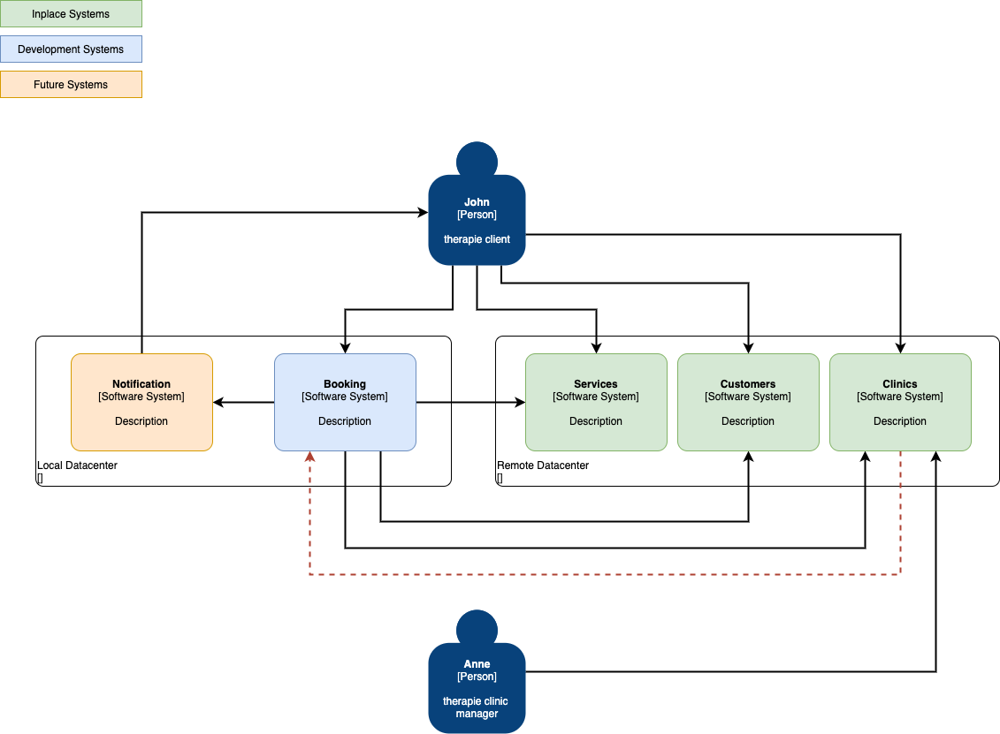

# Architecture
## Overall

* **Booking** - Responsible for process the clinic booking requests in a clinic for a service
* **Customer** - Responsible for manage the customers information 
* **Services** - Responsible for manage the types of clinic services , including its price and duration
* **Clinics** - Responsible for manage the clinics information and time slots for the services 
* **Notification** - Responsible for inform the customers about changes and events. The reason for this component is to handle changes in the clinic availability. **This has not been implemented**   

Booking system uses Clinics, customers and service system to validate customers bookings, generate the available booking slots. Any change on the service duration or clinic time slots would require rescheduling the already booked services. Any updates on service duration or clinic service time slots needs to be notified to booking system (red dashed arrow)  

## Deployment

### CI/CD 
The code is stored on GitHub any commit will trigger the pipeline on CircleCI which will build an image and store it on a private ECR. After upload the image the CI/CD request to the Kubernetes cluster to update the deployment image, triggering the deployment pods destruction and the pod creation for the new image.

The in the [Martin Fowler's Pyramid of tests](https://martinfowler.com/articles/microservice-testing/#conclusion-test-pyramid)
we are using 2 levels of tests: [component test](https://martinfowler.com/articles/microservice-testing/#conclusion-summary) (CT suffixes in the test classes) and unit test. In the component test we are using in memory database and mocking the http rest client, the unit tests are intended to business classes. Currently, the project has above 90% code coverage.  
  
### Deployed application 
The requests are handled on the AWS API Gateway, which send to the via VPC link to  the booking Service, which is a Load balancer Kubernetes service implemented by a AWS network load balancer, which is a VPC link requirement. The load balancer sends the requests to the pods.

In the standalone mode, the booking service uses as datasource is in memory H2 and in memory cache.
However, when it is running in a Kubernetes cluster the booking services uses a mysql database as datasource for bookings and Redis as caching mechanism.
     

## Components and Layers

The controller layer receives the requests transforming them in DTOs (when it is the case) and handing over to the service layer which executes the business rules and invokes the persistence when booking or integration layer when request information from other services.

### Controller Layer

The controller layer uses spring-WS to expose the rest endpoints, no authorization layer has been added as that will be handled at API gateway level.
The API is defined in the booking openApi spec [file](../openApi/spec/booking-spec.yaml).

The booking controller is the only service exposed in the API, there are 3 endpoints
* **GET /clinics/{clinicId}/bookings** - which retrieves all the bookings. There are some security implications on that then either remove the access as it may retrieve all information on database consuming a lot of resources or add mandatory query parameters with pagination to limit the amount of resources the request can use.
* **POST /bookings** - it is an idempotent endpoint as we are using a header x-idempotent-key, adding the clinic id, service id, date and time to guarantee the key is unique, this way preventing database resources to be used to process the request. Another option is to use PUT which also already has the idempotent semantic associated to the request.
* **GET /clinics/{clinicId}/services/{serviceId}/bookings/available/{yyyy-MM-dd}** - it is a new feature which retrieves only the free spots to book, it gets the service duration and the time slots for the day and generates all possible clinical service time slot and then removing all the ones which has been booked. It would be if in this endpoint we drop the "bookings"

The controller layer contains internally a error handling layer which intercepts exceptions and transform the exceptions into informative error information, logging the information and/or exception and identifying error uniquely, allowing the client pin point a problem when dealing with customer support.  
### Service Layer
In the service layer we have 4 components, booking, clinics, service(clinic services type) and customer. 

The service and customer components are implemented as adapters for the integration layer. 

The booking component uses the other services to gather information to decide to proceed or not with the service booking.  

The most complex component is the clinic service, it mixes business logic with the access to the integration layer and business logic. To keep the separation of concerns the clinic component implementation has been divided in 3 classes, one to access the integration layer (ClinicServicesRestAdapter), the second to manage the business logic (TimeAvailabilityLogic) and the last one(ClinicServicesBusinessWrapper) to put the other two to work together implementing the decorator pattern.
All the services define an interface to represent the contract.
      
### Persistence Layer
The persistence layer has been only implemented for booking, it utilizes spring-data and JPA
We are using Flyway to manage the database schema the scripts ara located at [flyway directory](../src/main/resources/db/migration/V1.0.0_1__GH-1.sql) 

### Integration Layer
The integration layer uses feign framework and we have added a cache layer for the retrieved information to prevent 
disruptions. 
The main concern when dealing with caching is the invalidation policy. As change the information regarding a clinic, 
a service or time slot implies in either lack of flexibility regarding changes on the service duration or time slots or 
create a complex solution to deal with variable time slots and services durations.       

### Exception Handling

## Design decisions and trade-offs
The principle plus the constraints and assumptions are used to guide the design decisions 

#### Principles

* Lower latency response
* high availability 
* keep it simple

#### Constraints  
* The booking service is located in a different datacenter and may lead to high latency

#### Assumptions 
* As the clinics service doesn't return the time zones for the clinics, we are assuming 
time slots uses the server location time zone
* There is no appointment which start at day X and finishes at day X+1

#### Decisions

* As the concurrency in the booking is hard, a trade off must be put in place, compromise the schedule flexibility with guaranteed no double bookings
* Caching for Services and clinic timeslots are mandatory to prevent complications on booking and a messaging systems must to be 
put in place to notify booking service regarding the changes on service duration and time slots  
* Use relational database due query capabilities pagination for example, even booking looks like a key value pair

#### Improvements
* Use reactive approach as there are other services, in this case it is more relevant as they are in another datacenter
* configure the resilience layer on feign  
* add traceability sleuth 
* for memory cache use one which evict the objects

